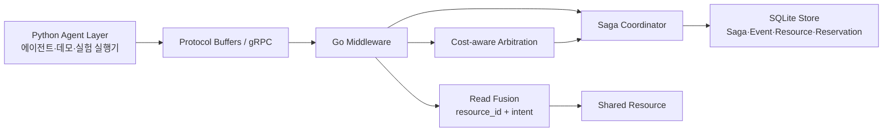

# Agentic Middleware

Agentic Middleware는 여러 LLM 에이전트가 동일한 외부 자원을 읽고, 추론하고,
변경을 요청하는 상황을 다루기 위한 트랜잭션 미들웨어입니다.

일반적인 데이터베이스 트랜잭션은 짧고 접근 패턴이 비교적 명확하지만, 에이전트의
작업은 추론과 도구 호출 때문에 오래 실행되고 다음 행동을 미리 예측하기 어렵습니다.
이 프로젝트는 에이전트가 추론하는 동안 데이터베이스 연결이나 락을 유지하지 않으면서,
공유 자원 접근을 조정하고 실패한 작업을 복구하는 방법을 구현합니다.

## 주요 기능

- 동일한 자원과 의도를 가진 동시 읽기 요청을 묶어 처리하는 읽기 융합
- 토큰 사용량과 추론 지연시간을 비용 신호로 사용하는 커밋 중재
- 체크포인트, 검증, 역순 보상으로 구성된 Saga 수명주기
- Saga 상태, 이벤트, 자원 재고와 예약의 SQLite 영속화
- 서버 재시작 이후 상태 및 이벤트 복구
- 비교 모드와 반복 실행을 지원하는 실험 자동화

> 이 저장소의 실험은 각 미들웨어 기능의 동작과 비교 방법을 확인하기 위한 통제된
> 시뮬레이션입니다. 측정값을 일반적인 운영 환경의 성능으로 해석하지 않습니다.

## 전체 아키텍처



Python 계층은 에이전트 워크플로와 실험을 실행하고, Go 계층은 공유 자원 접근 정책과
Saga 상태 전이를 담당합니다. 두 계층의 계약은
[`proto/middleware.proto`](proto/middleware.proto)를 단일 원천으로 사용합니다.

## 요청 처리 흐름

```text
BeginSaga
  -> RegisterSagaStep(checkpoint + compensation)
  -> ReadResource(read fusion)
  -> Agent reasoning
  -> ValidateSaga
  -> CommitTransaction(cost-aware arbitration)
       -> 승인: COMMITTED
       -> 거절: ABORTED -> reverse compensation -> COMPENSATED
```

Saga를 사용하지 않는 단순 비교 클라이언트도 `ReadResource`와
`CommitTransaction`을 직접 호출할 수 있습니다.

## 저장소 구조

```text
.
├── proto/                 # gRPC API의 단일 원천
├── middleware-go/         # Go 미들웨어 서버와 영속 저장소
│   ├── main.go            # 읽기 융합, 커밋 중재, metrics 서버
│   ├── saga.go            # Saga 상태 머신과 보상 흐름
│   └── sqlite_store.go    # Saga·이벤트·자원·예약 영속화
├── agent-python/          # Python 클라이언트, 데모, 실험 자동화
├── scripts/               # 반복 가능한 실험 실행 스크립트
├── docs/                  # 설계 및 실행 문서
└── agentic_scenario.py    # 선택적 AutoGen 연동 시나리오
```

## 빠른 실행

### 1. 의존성 준비

```sh
python3 -m pip install -r requirements.txt
```

Go 의존성은 `middleware-go/go.mod`에 정의되어 있습니다.

### 2. 미들웨어 실행

```sh
cd middleware-go
TICKET_STOCK=3 SAGA_DB_PATH=data/middleware.db \
  GOCACHE=/private/tmp/agenic-middleware-gocache go run .
```

기본 gRPC 주소는 `localhost:50051`, metrics 주소는 `localhost:8080`입니다.

### 3. Saga 데모 실행

다른 터미널에서 실행합니다.

```sh
cd agent-python
python3 saga_demo.py
```

동일한 DB 경로로 미들웨어를 재시작한 뒤 복구 상태를 확인할 수 있습니다.

```sh
cd agent-python
python3 recovery_check.py
```

## 실험 실행

짧은 비교 실행:

```sh
./scripts/run_live_experiment.sh
```

반복 실행:

```sh
./scripts/run_paper_experiment.sh
```

실험은 `baseline`, `qcfuse`, `full` 모드의 동작 차이를 관찰합니다. 고정 출력
디렉터리를 다시 사용할 때는 이전 SQLite 상태가 남을 수 있으므로, 새 출력 경로를
사용하거나 기존 실험 DB를 정리해야 합니다.

자세한 목적과 해석 범위는 [실험 가이드](docs/experiment-guide.md)를 참고합니다.

## 검증

```sh
cd middleware-go
GOCACHE=/private/tmp/agenic-middleware-gocache go test ./...
GOCACHE=/private/tmp/agenic-middleware-gocache go test -race ./...
```

```sh
python3 -m py_compile \
  agent-python/agent_client.py \
  agent-python/deterministic_demo.py \
  agent-python/saga_demo.py \
  agent-python/experiment_runner.py \
  agent-python/recovery_check.py

cd agent-python
python3 -m unittest test_experiment_stats.py
```

Protocol Buffers 계약을 변경했다면 생성 코드를 다시 만듭니다.

```sh
python3 -m grpc_tools.protoc -I proto \
  --python_out=agent-python \
  --grpc_python_out=agent-python \
  --pyi_out=agent-python \
  proto/middleware.proto
```

Go 생성 코드는 설치된 `protoc-gen-go`, `protoc-gen-go-grpc` 환경을 사용해 동일한
`proto/middleware.proto`에서 갱신해야 합니다. 생성 파일은 직접 수정하지 않습니다.

## 문서

- [전체 아키텍처](docs/architecture.md)
- [트랜잭션 수명주기](docs/transaction-lifecycle.md)
- [읽기 융합](docs/qcfuse-read-fusion.md)
- [비용 인지 커밋 중재](docs/atcc-cost-aware-arbitration.md)
- [Saga 복구와 영속성](docs/saga-recovery.md)
- [실험 가이드](docs/experiment-guide.md)
- [데모 가이드](docs/demo-guide.md)
- [현재 한계와 향후 확장](docs/limitations-and-future-work.md)

## 구현 범위

이 프로젝트는 AIOS, SagaLLM, ATCC, QCFuse의 전체 구현을 재현하지 않습니다.
다중 에이전트가 공유 자원에 접근하는 문제를 중심으로 관련 개념을 선택해 하나의
실행 가능한 미들웨어로 구성했습니다.

- QCFuse-inspired 구현은 KV 캐시 융합이 아니라 동시 자원 읽기 융합입니다.
- ATCC-inspired 구현은 강화학습 정책이 아니라 고정 비용 점수 기반 중재입니다.
- SagaLLM-compatible 구현은 전체 계획 프레임워크가 아니라 공유 자원 트랜잭션
  수명주기와 복구 계층입니다.

세부 범위는 [현재 한계와 향후 확장](docs/limitations-and-future-work.md)에 정리되어
있습니다.
