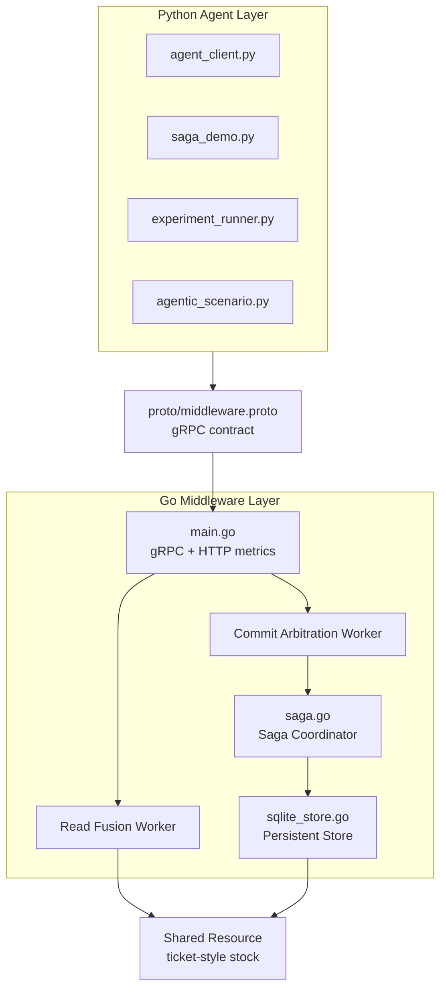
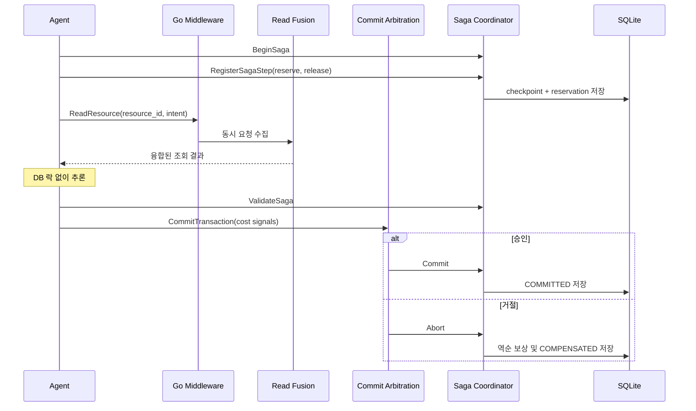

# 전체 아키텍처

## 설계 목표

Agentic Middleware는 에이전트의 추론 과정과 공유 자원 트랜잭션을 분리합니다.
에이전트는 자원을 읽은 뒤 락이나 DB 연결을 점유하지 않은 상태로 추론하고, 마지막
변경 요청만 미들웨어의 중재를 거칩니다.

이 구조의 목표는 다음과 같습니다.

- 에이전트 프레임워크와 자원 보호 정책을 분리한다.
- 동일한 자원 읽기의 중복 처리를 줄일 수 있는 지점을 제공한다.
- 충돌 시 커밋 대상을 명시적인 정책으로 선택한다.
- 실패한 장기 워크플로를 보상하고 상태를 복구한다.
- 실험과 데모에서 각 정책을 독립적으로 비교할 수 있게 한다.

## 계층 구성

### Python Agent Layer

Python 계층은 미들웨어의 클라이언트이자 워크로드 생성기입니다.

| 파일 | 역할 |
| --- | --- |
| `agent-python/agent_client.py` | 기본 읽기 및 커밋 요청 예시 |
| `agent-python/deterministic_demo.py` | 고정된 입력으로 읽기·중재 동작 시연 |
| `agent-python/saga_demo.py` | Saga 체크포인트·검증·보상 시연 |
| `agent-python/recovery_check.py` | 서버 재시작 이후 영속 상태 확인 |
| `agent-python/experiment_runner.py` | 비교 모드별 서버 실행과 반복 워크로드 |
| `agent-python/experiment_stats.py` | 실험 요약 통계와 HTML 보고서 생성 |

에이전트 구현은 미들웨어 내부 정책을 알 필요가 없습니다. Protocol Buffers로 정의된
요청을 보내고, 승인·거절·Saga 상태를 응답으로 받습니다.

### Protocol Buffers / gRPC

[`proto/middleware.proto`](../proto/middleware.proto)는 계층 간 계약의 단일
원천입니다. 읽기, 커밋, Saga 수명주기 메시지를 정의하며 Go와 Python 생성 코드는
이 파일에서 만들어집니다.

gRPC를 사용한 이유는 다음과 같습니다.

- Python과 Go 사이에 명시적인 타입 계약을 제공한다.
- 에이전트가 누락하거나 잘못 전달한 필드를 서버 경계에서 다루기 쉽다.
- 다양한 에이전트 프레임워크에서 동일 API를 호출할 수 있다.

### Go Middleware Layer

[`middleware-go/main.go`](../middleware-go/main.go)는 gRPC 요청 수신, 읽기 융합,
커밋 중재와 HTTP metrics 제공을 담당합니다. 읽기와 커밋 요청은 Go channel에
수집되며, 설정된 시간 창 단위로 처리됩니다.

[`middleware-go/saga.go`](../middleware-go/saga.go)는 Saga 상태 전이, 결정적
검증, 커밋과 역순 보상을 담당합니다.

[`middleware-go/sqlite_store.go`](../middleware-go/sqlite_store.go)는 Saga,
단계, 이벤트, 자원 재고와 예약을 SQLite에 저장합니다.

## 데이터 흐름

## 설정

주요 환경 변수는 다음과 같습니다.

| 환경 변수 | 기본값 | 설명 |
| --- | --- | --- |
| `MIDDLEWARE_GRPC_ADDR` | `:50051` | gRPC 수신 주소 |
| `MIDDLEWARE_METRICS_ADDR` | `:8080` | metrics HTTP 주소 |
| `QCFUSE_WINDOW_MS` | `100` | 읽기 요청 수집 시간 창 |
| `ATCC_WINDOW_MS` | `3000` | 커밋 후보 수집 시간 창 |
| `ATCC_TOKEN_WEIGHT` | `0.002` | 토큰 비용 가중치 |
| `ATCC_LATENCY_WEIGHT` | `0.5` | 추론 지연 가중치 |
| `TICKET_STOCK` | `1` | 자원의 초기 재고 |
| `SAGA_DB_PATH` | `data/middleware.db` | SQLite 저장 경로 |
| `EXPERIMENT_MODE` | `full` | `baseline`, `qcfuse`, `full` |

## 설계 경계

현재 구조는 단일 Go 프로세스와 SQLite를 사용하는 연구 프로토타입입니다. 미들웨어
계층의 책임과 상태 흐름을 명확하게 보여주는 데 초점을 맞추며, 다중 노드 합의나
운영 환경의 장애 조치는 포함하지 않습니다.
