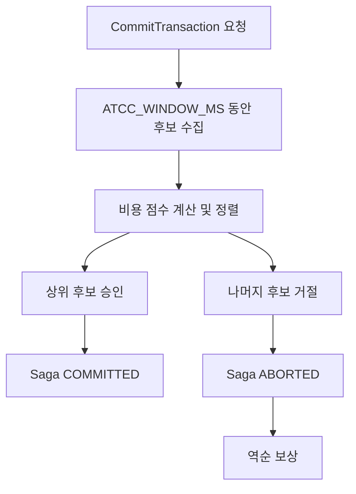

# 비용 인지 커밋 중재

## 목적

동일한 제한 자원에 여러 에이전트가 커밋을 요청하면 일부 요청은 거절되어야 합니다.
선착순이나 무작위 선택은 구현이 단순하지만, 이미 긴 추론과 도구 호출을 수행한 요청을
거절할 수 있습니다.

이 프로젝트는 ATCC의 비용 인지 우선순위 개념에서 영감을 받아, 에이전트가 보고한
토큰 사용량과 추론 지연시간을 커밋 후보 선택 신호로 사용합니다.

## 비용 점수

현재 구현의 점수는 다음과 같이 계산됩니다.

```text
cost = accumulated_tokens × ATCC_TOKEN_WEIGHT
     + inference_latency_sec × ATCC_LATENCY_WEIGHT
```

기본 가중치는 다음과 같습니다.

```text
ATCC_TOKEN_WEIGHT=0.002
ATCC_LATENCY_WEIGHT=0.5
```

이 점수는 실제 청구 비용이나 작업의 비즈니스 가치를 정확하게 나타내는 값이 아닙니다.
명시적인 선택 정책을 비교하고 관찰하기 위한 비용 대리변수입니다.

## 처리 흐름



[`middleware-go/main.go`](../middleware-go/main.go)의 commit worker는 channel에서
요청을 수집하고, 실험 모드에 따라 후보 순서를 결정합니다.

## 비교 모드

| 모드 | 커밋 후보 선택 |
| --- | --- |
| `baseline` | 비용을 사용하지 않는 기본 순서 |
| `qcfuse` | 비용을 사용하지 않는 기본 순서 |
| `full` | 계산된 비용 점수의 내림차순 |

`full` 모드는 정의된 점수 정책에 따라 후보를 결정적으로 선택하는 동작을 확인하기
위한 모드입니다. 특정 요청의 실제 성공 가능성이나 전체 시스템의 경제적 효용을
보장하는 정책은 아닙니다.

## Saga 연결

커밋 요청에 `saga_id`가 있으면 중재 결과가 워크플로 상태에 연결됩니다.

- 승인: `SagaCoordinator.Commit` 호출
- 거절: `SagaCoordinator.Abort` 호출 후 역순 보상

이 연결을 통해 단순한 커밋 거절 응답을 워크플로 수준의 상태 전이와 복구 과정으로
확장합니다.

## 정책상 고려사항

현재 점수만 지속적으로 사용하면 높은 비용 요청이 반복해서 우선될 수 있습니다. 운영
환경에서는 다음 요소를 추가로 고려해야 합니다.

- 오래 대기한 요청을 보호하는 aging
- 사용자 또는 작업 우선순위
- 요청 성공 가능성과 자원 가치
- 공정성과 starvation 방지
- 비용 보고값의 신뢰성 검증
- 자원별로 다른 중재 정책
