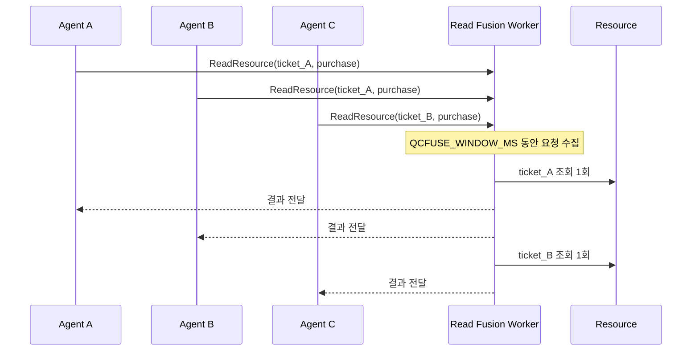

# 읽기 융합

## 목적

여러 에이전트가 같은 공유 자원을 비슷한 시점에 조회하면 동일한 읽기가 반복될 수
있습니다. 읽기 융합은 짧은 시간 창에 도착한 호환 가능한 요청을 묶고, 한 번의 자원
조회 결과를 요청자들에게 전달하는 메커니즘입니다.

이 구현은 QCFuse의 질의 중심 재사용 관점에서 영감을 받았지만, 원 논문의 KV 캐시
융합을 구현한 것은 아닙니다. 본 프로젝트에서 융합 대상은 미들웨어의 논리적 자원
읽기입니다.

## 융합 키

요청은 다음 두 값을 결합한 키로 그룹화됩니다.

```text
resource_id + intent
```

- `resource_id`: 실제 조회 대상
- `intent`: 조회 목적이나 작업 문맥

같은 자원을 조회하더라도 목적이 다르면 다른 그룹으로 처리합니다. 이는 서로 다른
의미의 요청을 같은 결과로 처리하는 위험을 줄이기 위한 경계입니다.

## 처리 흐름



[`middleware-go/main.go`](../middleware-go/main.go)의 읽기 worker는 Go channel에서
요청을 수집한 뒤 모드와 키에 따라 그룹을 만듭니다. 각 요청은 개별 응답 채널을
가지며, 그룹 처리 결과가 모든 대기 요청으로 전달됩니다.

## 비교 모드

| 모드 | 읽기 동작 |
| --- | --- |
| `baseline` | 요청을 각각 독립적인 논리적 조회로 처리 |
| `qcfuse` | 동일 키 요청을 융합 |
| `full` | 동일 키 요청을 융합하고 비용 인지 커밋 중재도 적용 |

## 관찰 지표

`/metrics`는 다음 카운터를 제공합니다.

- `read_requests`: 수신한 읽기 요청 수
- `fused_read_batches`: 생성한 융합 배치 수
- `fused_read_requests`: 융합 배치에 포함된 요청 수
- `logical_db_reads`: 미들웨어가 수행한 논리적 조회 수
- `saved_db_reads`: 개별 처리와 비교해 생략된 논리적 조회 수

이 값은 물리 디스크 I/O나 실제 DB 엔진의 페이지 접근 횟수가 아닙니다. 미들웨어
정책이 요청을 어떻게 묶었는지 확인하기 위한 논리적 카운터입니다.

## 안전성과 한계

- 문자열 기준으로 동일한 `resource_id`와 `intent`만 융합합니다.
- 짧은 시간 창 밖에서 도착한 요청은 별도 배치로 처리합니다.
- 결과의 유효 기간이나 자원 버전 검증은 현재 포함하지 않습니다.
- 실제 서비스에서는 읽기 일관성 요구와 오래된 결과 허용 범위를 추가로 정의해야 합니다.
