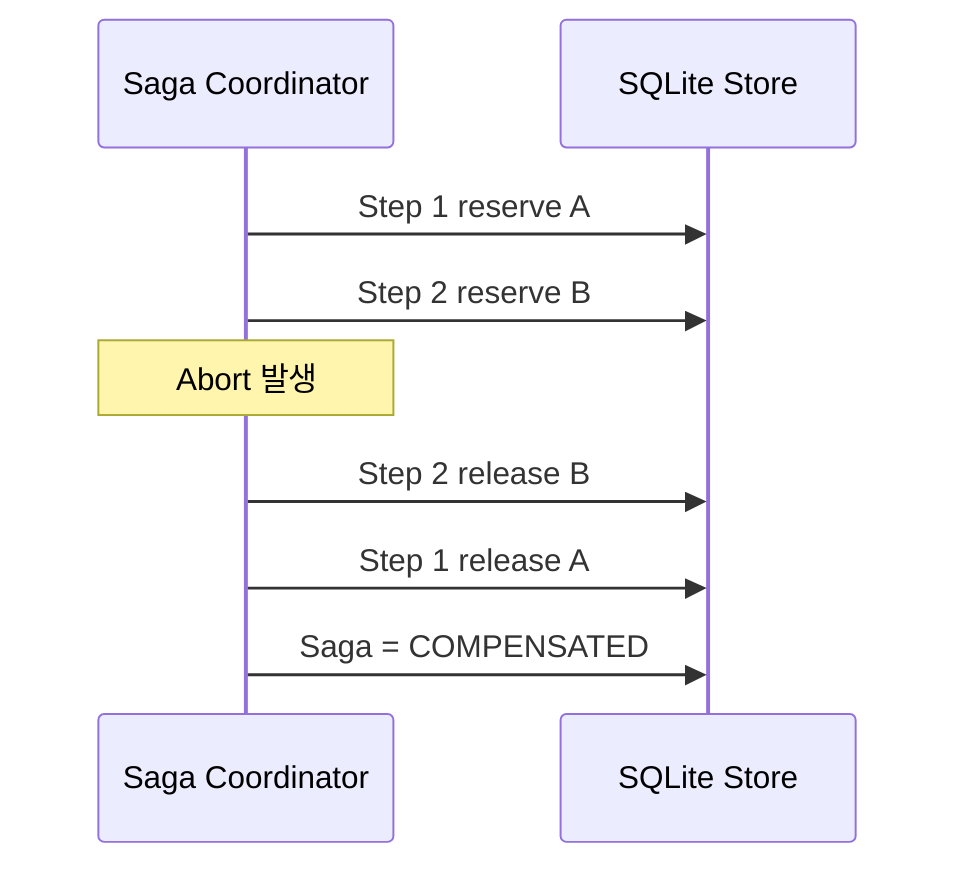

# Saga 복구와 영속성

## 목적

에이전트 워크플로는 여러 외부 작업을 순차적으로 수행할 수 있습니다. 중간 단계가
완료된 뒤 최종 커밋이 거절되거나 시스템 오류가 발생하면, 이미 발생한 외부 효과를
정리할 방법이 필요합니다.

Saga는 각 단계의 보상 행동을 함께 기록하고, 실패 시 완료된 단계를 역순으로
보상합니다. 본 프로젝트는 이 수명주기를 공유 자원 미들웨어에 구현합니다.

## 상태 모델

### Saga 상태

| 상태 | 의미 |
| --- | --- |
| `ACTIVE` | 단계 등록과 검증을 수행할 수 있는 상태 |
| `VALIDATED` | 결정적 검증을 통과한 상태 |
| `VALIDATION_FAILED` | 검증 조건을 만족하지 못한 상태 |
| `COMMITTED` | 커밋 중재에서 승인된 상태 |
| `ABORTED` | 중재 거절 또는 명시적 중단 상태 |
| `COMPENSATED` | 완료된 단계의 보상이 끝난 상태 |
| `COMPENSATION_FAILED` | 지원하지 않거나 실패한 보상이 존재하는 상태 |

### 단계 상태

- `COMPLETED`: 행동이 완료되어 필요 시 보상해야 하는 단계
- `COMPENSATED`: 보상이 완료된 단계
- `COMPENSATION_FAILED`: 보상 실행에 실패한 단계

## 역순 보상



[`middleware-go/saga.go`](../middleware-go/saga.go)의 `Abort`는 단계 목록을 뒤에서부터
순회합니다. 보상 실패가 발생하면 이를 성공으로 처리하지 않고
`COMPENSATION_FAILED` 상태와 이벤트를 기록합니다.

## 지원하는 자원 행동

현재 SQLite 저장소가 직접 실행하는 typed action은 다음과 같습니다.

```text
reserve <resource_id>
release <resource_id>
```

예약은 자원 재고를 감소시키고 `resource_reservations`에 상태를 기록합니다. 보상은
`RESERVED` 상태인 예약만 `RELEASED`로 변경하고 재고를 복구합니다.

같은 보상을 다시 요청해도 이미 해제된 예약은 다시 재고를 증가시키지 않습니다. 이
멱등성은 재시도나 중복 호출 상황에서 보상 효과가 중복 적용되는 것을 막습니다.

## 영속 저장소

[`middleware-go/sqlite_store.go`](../middleware-go/sqlite_store.go)는 다음 테이블을
관리합니다.

| 테이블 | 저장 내용 |
| --- | --- |
| `sagas` | Saga 상태, 검증 메시지, 중단 사유 |
| `saga_steps` | 순서가 있는 체크포인트와 보상 행동 |
| `saga_events` | append-only 상태 전이 이벤트 |
| `resources` | 공유 자원의 현재 재고 |
| `resource_reservations` | Saga별 자원 예약 상태 |

서버 시작 시 저장된 Saga와 단계를 읽어 `SagaCoordinator`의 메모리 상태를
재구성합니다. 자원 재고와 이벤트는 SQLite에서 계속 조회할 수 있습니다.

## 재시작 복구 확인

1. `SAGA_DB_PATH`를 지정해 미들웨어를 실행합니다.
2. `agent-python/saga_demo.py`를 실행합니다.
3. 미들웨어를 종료합니다.
4. 같은 `SAGA_DB_PATH`로 다시 실행합니다.
5. `agent-python/recovery_check.py`를 실행합니다.

재시작 복구와 새로운 실험 초기화는 목적이 다릅니다. 같은 DB 경로를 사용하면 기존
상태가 유지되며, 새로운 독립 실험을 원하면 새 DB 경로를 사용하거나 기존 실험 DB를
정리해야 합니다.

## 구현 범위

현재 보상 실행기는 ticket-style 자원 예약을 대상으로 합니다. 결제, 배송, 메시지
전송과 같은 외부 API는 보상 레지스트리와 idempotency key를 추가해 확장해야 합니다.
