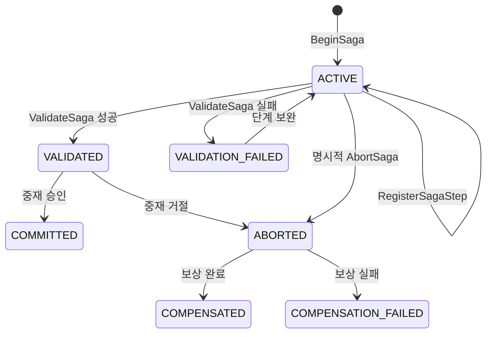

# 트랜잭션 수명주기

## Agentic Transaction의 특징

일반적인 OLTP 트랜잭션은 짧은 시간 안에 미리 정해진 쿼리를 수행합니다. 반면
Agentic Transaction은 읽기 결과와 LLM 추론에 따라 다음 행동이 달라지고, 외부
도구 호출을 포함해 오래 실행될 수 있습니다.

따라서 전체 추론 시간 동안 DB 락을 유지하는 방식은 적합하지 않습니다. 이 프로젝트는
자원 읽기, 에이전트 추론, 최종 커밋을 분리하고 Saga를 통해 중간 효과를 기록합니다.

## 전체 흐름



## 단계별 처리

### 1. Saga 시작

`BeginSaga`는 에이전트 ID와 목표를 받아 고유한 `saga_id`를 생성합니다. Saga는
`ACTIVE` 상태로 시작하며 영속 저장소와 이벤트 로그에 기록됩니다.

관련 구현: [`middleware-go/saga.go`](../middleware-go/saga.go)의 `Begin`

### 2. 체크포인트 등록

`RegisterSagaStep`은 이미 수행된 행동, 결과, 실패 시 실행할 보상 행동을 함께
등록합니다.

```text
action: reserve flight_ticket_A
compensation_action: release flight_ticket_A
```

현재 `reserve` 행동은 실제 SQLite 자원 재고를 감소시키고 예약 레코드를 생성합니다.
같은 Saga와 자원의 중복 예약은 다시 실행되지 않습니다.

### 3. 자원 읽기

`ReadResource`는 `resource_id`와 `intent`를 전달합니다. 같은 시간 창에 동일한
키를 가진 요청이 모이면 미들웨어는 하나의 논리적 조회로 처리할 수 있습니다.

읽기가 끝난 뒤 에이전트는 DB 연결이나 락을 보유하지 않은 상태에서 추론합니다.

### 4. 결정적 검증

`ValidateSaga`는 커밋 전에 Saga가 필요한 체크포인트를 갖고 있고 모든 단계가 완료
상태인지 확인합니다. 현재 검증은 실험 재현성을 위해 결정적 규칙으로 구현되어
있습니다.

### 5. 커밋 중재

`CommitTransaction`은 토큰 사용량과 추론 지연시간을 포함합니다. 같은 중재 창의
후보들은 설정된 정책에 따라 정렬됩니다.

- 승인 후보의 Saga는 `COMMITTED`로 전이됩니다.
- 거절 후보의 Saga는 `ABORTED`를 거쳐 보상을 실행합니다.

### 6. 역순 보상

보상은 완료된 체크포인트의 역순으로 실행됩니다. 여러 단계가 순차적으로 외부 효과를
만들었다면 마지막 효과부터 취소해야 앞 단계와의 의존성을 안전하게 정리할 수 있습니다.

## Saga 없이 사용하는 경우

성능 비교용 클라이언트는 `saga_id` 없이 읽기와 커밋만 호출할 수 있습니다. 이 경우
미들웨어의 읽기 융합과 중재 정책은 비교할 수 있지만, 워크플로 체크포인트와 보상
복구는 적용되지 않습니다.

## 상태 관찰

- gRPC `GetSagaState`: 현재 Saga와 단계 상태 조회
- HTTP `/events?saga_id=...`: 영속 이벤트 타임라인 조회
- HTTP `/resource?resource_id=...`: 현재 자원 재고 조회
- HTTP `/metrics`: 미들웨어 동작 카운터 조회
